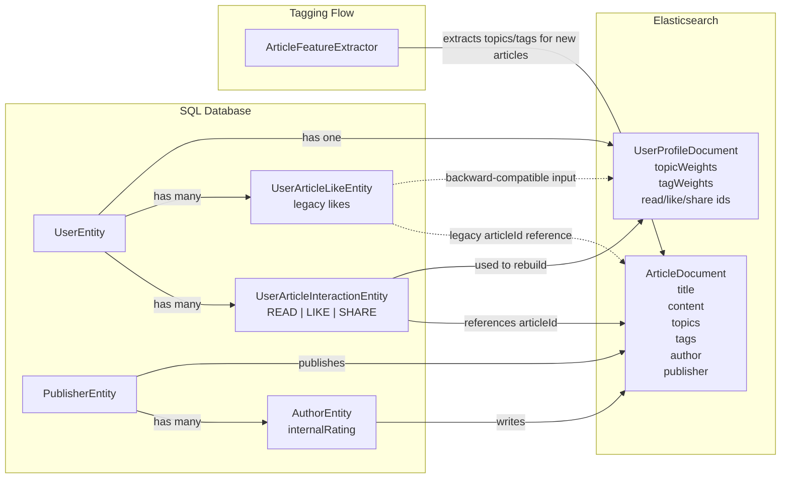

# Model Diagram

```mermaid
flowchart LR
    subgraph SQL["SQL Database"]
        U["UserEntity"]
        UI["UserArticleInteractionEntity\nREAD | LIKE | SHARE"]
        UL["UserArticleLikeEntity\nlegacy likes"]
        P["PublisherEntity"]
        A["AuthorEntity\ninternalRating"]
    end

    subgraph ES["Elasticsearch"]
        AD["ArticleDocument\ntitle\ncontent\ntopics\ntags\nauthor\npublisher"]
        UP["UserProfileDocument\ntopicWeights\ntagWeights\nread/like/share ids"]
    end

    subgraph Tagging["Tagging Flow"]
        FE["ArticleFeatureExtractor"]
    end

    P -->|has many| A
    P -->|publishes| AD
    A -->|writes| AD

    U -->|has many| UI
    U -->|has many| UL
    U -->|has one| UP

    UI -->|references articleId| AD
    UL -.->|legacy articleId reference| AD

    UI -->|used to rebuild| UP
    UL -.->|backward-compatible input| UP

    FE -->|extracts topics/tags for new articles| AD
```
